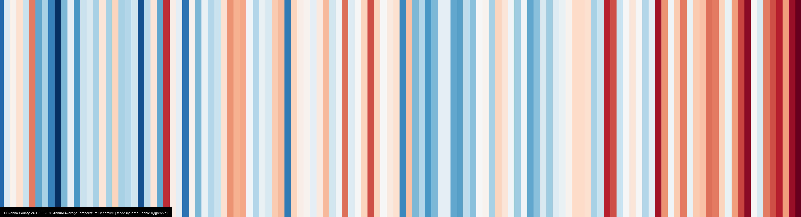
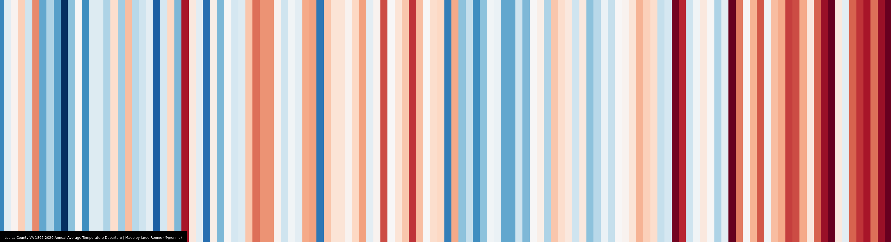

```{r set-options, echo=FALSE}
options(width = 105)
knitr::opts_chunk$set(dev='png', dev.args = list(type = "cairo-png"), dpi=300, cache=TRUE)
pdf.options(useDingbats = TRUE)
```

# Week One

## Temperature Overtime 

  I worked on familiarizing myself with the show your stripes website, climate tracking, NOAA, the berkeley earth project, and all things related to climate data that I didn't know about.  I also learned the SF package, github desktop and using github from R. Lastly, I learned about shapefiles, using ArcGIS, extracting and plotting shapefiles. 
  
### Guiding questions 
* Can we access them readily, and how (download, api, etc.)? If it can be called directly from the source into R (or Python), that’s our preferred approach.

* What’s the smallest spatial scale available? What format are they in (csv, json, excel, etc; or for spatial data, raster or vector)? What time period/years are present?

* Could we use them to measure what we think we can? What attributes/variables are available? How have they been used in related work?

* How are they generated, where do they come from (e.g., processed from instruments/satellite, derived from surveys, modeled from multiple sources, etc.)?

* key regions (FIPS): 
The larger Charlottesville area: Charlottesville City (51540), Albemarle County (51003), Fluvanna (51065), Greene (51079), Louisa (51109), Nelson (51125)
The Eastern Shore area: Accomack (51001), Northhampton (51131)

## Show your Stripes and Berkeley Earth
  
* The image is only available for state data and the raw data is not available through the site. We can download the completed graphics and use another source (https://creativecommons.org/use-remix/) to build on the graphics and reuse them if necessary. 
  
* Berkeley earth also only has state level sources. We can download a txt file for virginia as a whole but not county level data.
  
## ArcGIS

* The images are available for county data but the raw data is not available through the site. I downloaded the completed graphics for the key regions. 

  + Charlottesville City (51540)


  + Albemarle County (51003)
 
  + Fluvanna (51065)
 

  + Greene (51079)
  

  + Louisa (51109)
  
   
  + Nelson (51125)
   

  + Accomack (51001)
 

  + Northhampton (51131)
 


## Forecast Scenarios

  The UCAR Climate Change Forecast Scenarios page (https://gisclimatechange.ucar.edu/gis-climatedata) allows downloads of data for a particular county as long as you can draw the location on the map using the box tool. It can forecast from 2006 up to year 2100 but it is only possible to download up to 10 years as shapefiles for each scenario. However, it is possible can download the full forecast as txt files. Please let me know if you would like me to download the data for the key regions and for what date ranges and scenarios. For shapefiles, I can download a 100 year forecast in 10 downloads if that is preferred to txt files.
  
  I found two other forecast tools but they are not as good as the UCAR website. 
  
  + The CREAT CLimate Scenarios Projection Map (https://www.arcgis.com/apps/MapSeries/index.html?appid=3805293158d54846a29f750d63c6890e) can show forecasts for year 2035 and 2060 for temperature, percipitation, storms, extreme heat, and sea levels. It is possible to get county forecast by zooming into the map and clicking on the county of interest. However, it is not possible to download the data.
  
  + The NOAA CM2.X dataset contains the results of two models run by the NOAA’s Geophysical Fluid Dynamics Laboratory (GFDL). They show general climate conditions during the 20th century and projections into the 21st century based on various climate scenarios. It can be downloaded at (https://www.ncdc.noaa.gov/data-access/model-data/model-datasets/cm2-global-coupled-climate-models-cm2x). While it does not show the map of the forecasts, we can download the data and create our own. This is also a global forecast so chances of extracting county level data might be slim. It covers January 1, 1901 to April 21, 2300. 
  
## NOAA Data

  NOAA has data that covers county, regional, state, country, and global levels. NOAA data is extractable in txt format and through API for date ranges 1895-2021.
  
  + Monthly readings for each county measuring 
    + 01 = Precipitation
    + 02 = Average Temperature
    + 27 = Maximum Temperature
    + 28 = Minimum Temperature

  + The data is used to calculate the state temperature which is then used in regional and country-wide calculations. Minimum and Maximum would be useful if we wanted to run our own calculations but the average temperature is usually a standard measurement of temperature overtime.

  The nClimDiv dataset contains the county information that we are looking to access from NOAA. The dataset is derived from the station information in the daily Global Historical Climatology Network (GHCN) dataset. Therefore, the nClimDiv is the processed data format of the GHCN and would be more useful to us than getting raw GHCN data. 
  
  My NOAA script so far is: 
  
```{r libs, message=FALSE, warning=FALSE}
# 0. Load libraries and data
library(tidyverse)
library(stargazer) # for summary table
library(janitor) # for tabyl
library(tigris) # for shapefiles
library(sf) # for spatial joins
library(leaflet) # for map
library(viridis)
library(googlesheets4)
library(RColorBrewer)
library(ggplot2)
library(gganimate)
library(gapminder)
library(transformr)
library(gifski)
library(ggrepel)
library(hrbrthemes)
library(devtools)
library(climatestripes)
library(lubridate)
library(ggExtra)
library(tidyr)
library(dygraphs)
library(xts)
library(lubridate)
library(zoo)
library(tidyselect)
```


  This was to load the average temperature data 
```{r load new data}
climcounty <- read.table(file = "climdiv-tmpccy-v1.0.0-20210604.txt", header = FALSE)
head(climcounty)
```

This was to load the county data with shapefiles
```{r load new data shp}
ccshape <- st_read("/Users/msbugatti/Documents/GitHub/EQCSummer2021/counties")
```

This was to filter the county data to the counties of interest
```{r filter}
ccshape1 <- ccshape %>% filter(FIPS %in% c(51540, 51003, 51065, 51079, 51109, 51125, 51001, 51131))
```

This was my first run at ploting the data. It is very bland.
```{r ggplot}
ggplot() + 
  geom_sf(data = ccshape1, size = 3, color = "black", fill = "orange") + 
  ggtitle("Virginia Counties Plot") + 
  coord_sf()
```


### Goals for this week 

* Get NOAA data, clean it, and explore the observations (distributions across spatial units, summaries by spatial units, etc.) 

* Learn lovelace and other ploting skills for shapefiles in R

* Practice GitHub from terminal instead of GitHub desktop which is much more easy for me to use.
  
* Lastly, a gif of my life this week 

  
  
# Week Two and Three

After spending most of week two figuring out the data mapping. I worked on the animated map this week and spent more time trying to figure out why my map was displaying two labels for one frame during the animation process. I finally got it to work last night but am now dealing with a .nc read problem with the DAYMET dataset. This should be faster once I can read it into R. I am excited to work on the strips and yearly average data for the NOAA dataset. 

## My codes and the animated map for july are below.

```{r}
climcounty <- rename(climcounty, Fipsyear=V1, Jan=V2, Feb=V3, Mar=V4, Apr=V5, May=V6, Jun=V7, Jul=V8, Aug=V9, Sep=V10, Oct=V11, Nov=V12, Dec=V13)
```

```{r filter counties}
countyavgtemp <- climcounty %>% filter(Fipsyear %in% c(44540021895:44540022021, 44003021895:44003022021, 44065021895:44065022021, 44079021895:44079022021, 44109021895:44109022021, 44125021895:44125022021, 44001021895:44001022021, 44131021895:44131022021))
```


```{r}
countyavgtemp1 <- countyavgtemp %>%
  group_by(Fipsyear) %>% mutate(year = as.numeric(str_sub(Fipsyear, 8, )), CNTY_FIPS = str_sub(Fipsyear, 3, -7))
```

```{r}
countyavgtemp1 <- countyavgtemp1 %>%
                      dplyr::select(CNTY_FIPS, year, Jan, Feb,
                                Mar, Apr, May, Jun, Jul, Aug, Sep,
                                Oct, Nov, Dec, Fipsyear)
```

```{r}
ccshapegf <- left_join(ccshape1, countyavgtemp1, by ="CNTY_FIPS")
```


```{r}
countyavgsf <- st_as_sf(ccshapegf)
```

```{r}
ccshapegf <- cbind(ccshapegf, st_coordinates(st_centroid(ccshapegf)))
```


```{r}
ccshapeggf <- 
  ggplot(ccshapegf) +
  geom_sf(aes(fill = Jul), color = "black", alpha = .9) +
   geom_text_repel(data = ccshapegf, aes(X, Y, label = NAME), size = 4, nudge_x = 1, nudge_y = 0, fontface = "bold", hjust = 0.9) +
  scale_fill_fermenter(palette = "YlOrRd", direction = 1,   type = "seq", n.breaks = 8) +
     theme_void() +
  guides(fill =
           guide_colourbar(title.position="top", title.hjust = 0.5,
                           barwidth = 1)
  )  + 
  labs(fill = "Temperature ", title = 'Year: {frame_time}',
       caption = "Average temperature in July for 7 Counties") + 
 transition_time(as.integer(year)) +
ease_aes('linear') 
```

```{r}
animate(ccshapeggf, fps = 1, detail = 1, nframes = 127)
```


### Goals for this Week 

* Finish the DAYMET data clean.

* Work on the creating the stripes and a yearly average temperature data to create a new animation.

* Create the rmd scripts, csv output data, and data review file for NOAA and DAYMET. 

* Work on the new goals for this week. 

# Week Four and Week Five 

## Charlottesvile Counties 

```{r, echo = TRUE, warning = FALSE, message = FALSE}
noaa <- read_csv("noaa_cville_county.csv")
cvillefips <- c("540", "003", "065", "079", "109", "125")
meta <- read_sheet("https://docs.google.com/spreadsheets/d/1nqm3DuVXD1ObbVe_deacvT7uSLdBXfQJo3mkbqDwrVo/edit#gid=1573436636", sheet = "noaa")
```

```{r load and clean new data shp1, include=FALSE}
knitr::opts_chunk$set(echo = TRUE, warning = FALSE, message = FALSE)

cville_sf <- read_sf("/Users/msbugatti/Documents/GitHub/EQCSummer2021/counties")
cville_sf <- cville_sf %>% filter(FIPS %in% c(51540, 51003, 51065, 51079, 51109, 51125))
cville_sf <- cville_sf %>%
                      dplyr::select(NAME, STATE_FIPS, CNTY_FIPS, FIPS, geometry, AREA)
cville_sf1 <- left_join(cville_sf, noaa, by ="CNTY_FIPS")
```


```{r transpose the data1, include=FALSE}
knitr::opts_chunk$set(echo = TRUE, warning = FALSE, message = FALSE)

cville_sf1 <- st_as_sf(cville_sf1)
cville_sf1 <- cbind(cville_sf1, st_coordinates(st_centroid(cville_sf1)))
```

```{r remove na1, include=FALSE}
knitr::opts_chunk$set(echo = TRUE, warning = FALSE, message = FALSE)

cville_sf1 <- cville_sf1 %>%
                      dplyr::select(NAME, Year, CNTY_FIPS, X, Y,
                                geometry, everything())
cville_sf1$Year = as.numeric(cville_sf1$Year)
cville_sf1 <-  cville_sf1 %>% filter_at(vars(Janmin:Avg_Temppcp),all_vars(!is.na(.)))
```

## Data Source

Source: NOAA's Climate Divisional Database (nClimDiv), June 2021 release

* Download URL: [https://www.ncei.noaa.gov/pub/data/cirs/climdiv/counties.zip](https://www.ncei.noaa.gov/pub/data/cirs/climdiv/counties.zip)
* Download URL: [https://www.ncei.noaa.gov/pub/data/cirs/climdiv/](https://www.ncei.noaa.gov/pub/data/cirs/climdiv/)

    * Maximum Temperature: climdiv-tmaxcy-v1.0.0-20210707
    * Minimum Temperature: climdiv-tmincy-v1.0.0-20210707
    * Precipitation: climdiv-pcpncy-v1.0.0-20210707

### The Data Used Here

The Climate Divisional Dataset from the National Center For Environmental Information began as the only long-term temporally and spatially complete dataset from which to generate historical climate analyses (1895-2013) for the contiguous United States (CONUS). It was originally developed for climate division, statewide, regional, national, and population-weighted monitoring of drought, temperature, precipitation, and heating/cooling degree day values. 

There are 344 climate divisions in the CONUS. For each climate division, monthly station temperature and precipitation values are computed from the daily observations. The divisional values are weighted by area to compute statewide values and the statewide values are weighted by area to compute regional values. (Karl and Koss, 1984).

The data here is the county data from all the states in the contigous United States. While NOAA includes information on a variety of climate measures, we are focusing on the maximum, minimum temperature, and precipitation of the counties of interest. 

To Learn More, See: 

* [ National Center For Environmental Information and Data ](https://www.ncdc.noaa.gov/monitoring-references/maps/us-climate-divisions.php#grdd)


### Variable Descriptions

```{r}
glimpse(cville_sf1)
```

Observations are county level estimates of...

* Monthly maximum temperature for each county for years 1895-2021
    * Yearly average maximum temperature for each county for those years. 


* Monthly minimum temperature for each county for years 1895-2021
    * Yearly average minimum temperature for each county for those years. 


* Monthly precipitation for each county for years 1895-2021
    * Total yearly precipitation for each county for those years.


### Summaries 

5-number summaries of (non-missing) numeric variables (remove non-numeric observations)

```{r}
noaa %>% select(-c(CNTY_FIPS, Fipsyear, Year)) %>% 
  select(where(~is.numeric(.x) && !is.na(.x))) %>% 
  as.data.frame() %>% 
  stargazer(., type = "text", title = "Summary Statistics", digits = 0,
            summary.stat = c("mean", "sd", "min", "median", "max"))
```


## Maps, Warming Stripes, and Timeplots

### July Temperatures 

#### Maximum Temperature in July across Counties for all Years 

```{r}
cville_sf11a <- 
  ggplot(cville_sf1) +
  geom_sf(aes(fill = Julmax), color = "black", alpha = .9, na.rm = TRUE) +
   geom_text_repel(data = cville_sf1, aes(X, Y, label = NAME), size = 4, nudge_x = 1, nudge_y = 0, fontface = "bold", hjust = 0.9) +
  scale_fill_fermenter(palette = "YlOrRd", direction = 1,   type = "seq", n.breaks = 7) +
     theme_void() +
  guides(fill =
           guide_colourbar(title.position="top", title.hjust = 0.5,
                           barwidth = 1)
  )  + 
  labs(fill = "Temperature ", title = 'Year: {frame_time}',
       caption = "Maximum Temperature in July for Charlottesville Counties") + 
 transition_time(as.integer(Year)) +
ease_aes('linear') 
```

```{r}
animate(cville_sf11a, fps = 1, detail = 1, nframes = 127)
```

```{r, results = "asis"}
meta %>%
  filter(varname == "Julmax") %>% 
  select(about) %>% 
  as.list()
```


#### Minimum Temperature in July across Counties for all Years
      
  This is an interactive graph. Click on the graph to zoom, scroll through each year to see numeric temperature readings for all counties for each year. 

```{r}
cville_sf1a <- mutate(cville_sf1, date = str_c(Year, "07-16", sep = "-") %>% ymd())
```

```{r}
cville_sf1p <- select(cville_sf1a, NAME, date, Julmin)
cville_sf1p <- as.data.frame(cville_sf1p)
cville_sf1p <- select(cville_sf1p, -starts_with("geometry"))
cville_sf1g <- filter(cville_sf1p, NAME == "Greene")
cville_sf1al <- filter(cville_sf1p, NAME == "Albemarle")
cville_sf1al <- rename(cville_sf1al, NAME1 = NAME, Julmin1 = Julmin, date1 = date)
cville_sf1c<- filter(cville_sf1p, NAME == "Charlottesville")
cville_sf1c <- rename(cville_sf1c, NAME2 = NAME, Julmin2 = Julmin, date2 = date)
cville_sf1f<- filter(cville_sf1p, NAME == "Fluvanna")
cville_sf1f <- rename(cville_sf1f, NAME3 = NAME, Julmin3 = Julmin, date3 = date)
cville_sf1l <- filter(cville_sf1p, NAME == "Louisa")
cville_sf1l <- rename(cville_sf1l, NAME4 = NAME, Julmin4 = Julmin, date4 = date)
cville_sf1n <- filter(cville_sf1p, NAME == "Nelson")
cville_sf1n <- rename(cville_sf1n, NAME5 = NAME, Julmin5 = Julmin, date5 = date)
cville_sf1x <- cbind(cville_sf1g, cville_sf1al, cville_sf1c, cville_sf1f, cville_sf1l, cville_sf1n)
cville_sf1x <- rename(cville_sf1x, Greene = Julmin, Albemarle = Julmin1, Charlottesville = Julmin2, Fluvanna = Julmin3, Louisa = Julmin4, Nelson = Julmin5)
cville_sf1x <- cville_sf1x[ , -which(names(cville_sf1x) %in% c("date1","date2", "date3", "date4", "date5", "NAME", "NAME1", "NAME2", "NAME3", "NAME4","NAME5"))]
```

```{r}
cville_sf1x <- xts(x = cville_sf1x, order.by = cville_sf1x$date)
```

```{r graph, fig.width=3, fig.height=2,  message=FALSE, warning=FALSE}
dygraph(cville_sf1x, main = "Minimum Temperature in July across Counties for all Years", ylab = "Temperature (F)") %>%
  dySeries("Greene", label = "Greene") %>%
  dySeries("Albemarle", label = "Albemarle") %>%
  dySeries("Charlottesville", label = "Charlottesville") %>%
  dySeries("Fluvanna", label = "Fluvanna") %>%
  dySeries("Louisa", label = "Louisa") %>%
  dySeries("Nelson", label = "Nelson") %>%
  dyHighlight(highlightCircleSize = 3, 
              highlightSeriesBackgroundAlpha = 0.2,
              hideOnMouseOut = FALSE, highlightSeriesOpts = list(strokeWidth = 3)) %>% 
dyLegend(show = "always", hideOnMouseOut = FALSE, width = 400) %>% 
    dyRangeSelector(height = 20) %>%  dyOptions(colors = RColorBrewer::brewer.pal(6, "Set2"))
```

```{r, results = "asis"}
meta %>%
  filter(varname == "Julmin") %>% 
  select(about) %>% 
  as.list()
```


### Average Yearly Temperatures 

#### Average Yearly Maximum Temperature for Each County for all Years 
```{r  warming6a, echo = TRUE, warning = FALSE, message = FALSE}

#select only the annual temperature and year column
cville_sf1_yr <- select(cville_sf1, NAME, Year, Avg_Tempmax)

#rename the temperature column
cville_sf1_yr <- rename(cville_sf1_yr, ta = Avg_Tempmax)

```

```{r  warming7a, echo = TRUE, warning = FALSE, message = FALSE}
#create a date column because stripes only works with format = date

cville_sf1_yr <- mutate(cville_sf1_yr, date = str_c(Year, "01-01", sep = "-") %>% ymd())

```

```{r warming8a, echo = TRUE, warning = FALSE, message = FALSE}

#Filter out each County. No need to do theme again it's already set 
cville_sf1_yrg <- filter(cville_sf1_yr, NAME == "Greene")
cville_sf1_yra <- filter(cville_sf1_yr, NAME == "Albemarle")
cville_sf1_yrc <- filter(cville_sf1_yr, NAME == "Charlottesville")
cville_sf1_yrf <- filter(cville_sf1_yr, NAME == "Fluvanna")
cville_sf1_yrl <- filter(cville_sf1_yr, NAME == "Louisa")
cville_sf1_yrn <- filter(cville_sf1_yr, NAME == "Nelson")
```

```{r  warming4a, echo = TRUE, warning = FALSE, message = FALSE}

#Create the theme for the stripes image

theme_strip <- theme_minimal()+
                 theme(axis.text.y = element_blank(),
                       axis.line.y = element_blank(),
                       axis.title = element_blank(),
                       panel.grid.major = element_blank(),
                       legend.title = element_blank(),
                       axis.text.x = element_text(vjust = 3),
                       panel.grid.minor = element_blank(),
                        plot.title = element_text(size = 14, face = "bold")
                       )


col_strip <- brewer.pal(11, "RdBu")
```

##### Greene County Warming Stripes: Average Yearly Maximum Temperature
```{r stripes1ad,fig.width=10, fig.height=3,  message=FALSE, warning=FALSE}
 ggplot(cville_sf1_yrg,
             aes(x = date, y = 1, fill = ta))+
        geom_tile()+
           scale_x_date(date_breaks = "6 years",
                     date_labels = "%Y",
                     expand = c(0, 0))+
           scale_y_continuous(expand = c(0, 0))+
           scale_fill_gradientn(colors = rev(col_strip))+
             guides(fill = guide_colorbar(barwidth = 1))+
            labs(title = "Greene County Average Yearly Maximum Temperature 1895-2020",
                caption = "Data: NOAA Surface Temperature Analysis")+
              theme_strip
```

##### Louisa County Warming Stripes: Average Yearly Maximum Temperature
```{r stripes2ad,fig.width=10, fig.height=3, message=FALSE, warning=FALSE}
 ggplot(cville_sf1_yrl,
             aes(x = date, y = 1, fill = ta))+
        geom_tile()+
           scale_x_date(date_breaks = "6 years",
                     date_labels = "%Y",
                     expand = c(0, 0))+
           scale_y_continuous(expand = c(0, 0))+
           scale_fill_gradientn(colors = rev(col_strip))+
             guides(fill = guide_colorbar(barwidth = 1))+
            labs(title = "Louisa County Average Yearly Maximum Temperature 1895-2020",
                caption = "Data: NOAA Surface Temperature Analysis")+
              theme_strip
```

##### Nelson County Warming Stripes: Average Yearly Maximum Temperature
```{r stripes3ad,fig.width=10, fig.height=3, message=FALSE, warning=FALSE}
 ggplot(cville_sf1_yrn,
             aes(x = date, y = 1, fill = ta))+
        geom_tile()+
           scale_x_date(date_breaks = "6 years",
                     date_labels = "%Y",
                     expand = c(0, 0))+
           scale_y_continuous(expand = c(0, 0))+
           scale_fill_gradientn(colors = rev(col_strip))+
             guides(fill = guide_colorbar(barwidth = 1))+
            labs(title = "Nelson County Average Yearly Maximum Temperature 1895-2020",
                caption = "Data: NOAA Surface Temperature Analysis")+
              theme_strip
```

##### Albemarle County Warming Stripes: Average Yearly Maximum Temperature
```{r stripes4ad,fig.width=10, fig.height=3,  message=FALSE, warning=FALSE}
 ggplot(cville_sf1_yra,
             aes(x = date, y = 1, fill = ta))+
        geom_tile()+
           scale_x_date(date_breaks = "6 years",
                     date_labels = "%Y",
                     expand = c(0, 0))+
           scale_y_continuous(expand = c(0, 0))+
           scale_fill_gradientn(colors = rev(col_strip))+
             guides(fill = guide_colorbar(barwidth = 1))+
            labs(title = "Albemarle County Average Yearly Maximum Temperature 1895-2020",
                caption = "Data: NOAA Surface Temperature Analysis")+
              theme_strip
```

##### Charlottesville County Warming Stripes: Average Yearly Maximum Temperature
```{r stripes5ad,fig.width=10, fig.height=3, message=FALSE, warning=FALSE}
 ggplot(cville_sf1_yrc,
             aes(x = date, y = 1, fill = ta))+
        geom_tile()+
           scale_x_date(date_breaks = "6 years",
                     date_labels = "%Y",
                     expand = c(0, 0))+
           scale_y_continuous(expand = c(0, 0))+
           scale_fill_gradientn(colors = rev(col_strip))+
             guides(fill = guide_colorbar(barwidth = 1))+
            labs(title = "Charlottesville County Average Yearly Maximum Temperature 1895-2020",
                caption = "Data: NOAA Surface Temperature Analysis")+
              theme_strip
```

##### Fluvanna County Warming Stripes: Average Yearly Maximum Temperature
```{r stripes6ad,fig.width=10, fig.height=3, message=FALSE, warning=FALSE}
 ggplot(cville_sf1_yrf,
             aes(x = date, y = 1, fill = ta))+
        geom_tile()+
           scale_x_date(date_breaks = "6 years",
                     date_labels = "%Y",
                     expand = c(0, 0))+
           scale_y_continuous(expand = c(0, 0))+
           scale_fill_gradientn(colors = rev(col_strip))+
             guides(fill = guide_colorbar(barwidth = 1))+
            labs(title = "Fluvanna County Average Yearly Maximum Temperature 1895-2020",
                caption = "Data: NOAA Surface Temperature Analysis")+
              theme_strip
```

```{r, results = "asis"}
meta %>%
  filter(varname == "Avg_Tempmax") %>% 
  select(about) %>% 
  as.list()
```


#### Average Yearly Minimum Temperature across Counties for all Years 
  This is an interactive graph. Click on the graph to zoom, scroll through each year to see numeric temperature readings for all counties for each year. 
  
```{r, include=FALSE, message=FALSE, warning=FALSE}
cville_sf1am <- mutate(cville_sf1, date = str_c(Year, "12-16", sep = "-") %>% ymd())
```

```{r, include=FALSE, message=FALSE, warning=FALSE}
cville_sf1pm <- select(cville_sf1am, NAME, date, Avg_Tempmin)
cville_sf1pm <- as.data.frame(cville_sf1pm)
cville_sf1pm <- select(cville_sf1pm, -starts_with("geometry"))
cville_sf1gm <- filter(cville_sf1pm, NAME == "Greene")
cville_sf1alm <- filter(cville_sf1pm, NAME == "Albemarle")
cville_sf1alm <- rename(cville_sf1alm, NAME1 = NAME, Avg_Tempmin1 = Avg_Tempmin, date1 = date)
cville_sf1cm<- filter(cville_sf1pm, NAME == "Charlottesville")
cville_sf1cm <- rename(cville_sf1cm, NAME2 = NAME, Avg_Tempmin2 = Avg_Tempmin, date2 = date)
cville_sf1fm<- filter(cville_sf1pm, NAME == "Fluvanna")
cville_sf1fm <- rename(cville_sf1fm, NAME3 = NAME, Avg_Tempmin3 = Avg_Tempmin, date3 = date)
cville_sf1lm <- filter(cville_sf1pm, NAME == "Louisa")
cville_sf1lm <- rename(cville_sf1lm, NAME4 = NAME, Avg_Tempmin4 = Avg_Tempmin, date4 = date)
cville_sf1nm <- filter(cville_sf1pm, NAME == "Nelson")
cville_sf1nm <- rename(cville_sf1nm, NAME5 = NAME, Avg_Tempmin5 = Avg_Tempmin, date5 = date)
cville_sf1xm <- cbind(cville_sf1gm, cville_sf1alm, cville_sf1cm, cville_sf1fm, cville_sf1lm, cville_sf1nm)
cville_sf1xm <- rename(cville_sf1xm, Greene = Avg_Tempmin, Albemarle = Avg_Tempmin1, Charlottesville = Avg_Tempmin2, Fluvanna = Avg_Tempmin3, Louisa = Avg_Tempmin4, Nelson = Avg_Tempmin5)
cville_sf1xm <- cville_sf1xm[ , -which(names(cville_sf1xm) %in% c("date1","date2", "date3", "date4", "date5", "NAME", "NAME1", "NAME2", "NAME3", "NAME4","NAME5"))]
```

```{r, include=FALSE, message=FALSE, warning=FALSE}
cville_sf1xm <- xts(x = cville_sf1xm, order.by = cville_sf1xm$date)
```

```{r graph1, fig.width=3, fig.height=2, message=FALSE, warning=FALSE}
dygraph(cville_sf1xm, main = "Average Yearly Minimum Temperature across Counties for all Years", ylab = "Temperature (F)") %>%
  dySeries("Greene", label = "Greene") %>%
  dySeries("Albemarle", label = "Albemarle") %>%
  dySeries("Charlottesville", label = "Charlottesville") %>%
  dySeries("Fluvanna", label = "Fluvanna") %>%
  dySeries("Louisa", label = "Louisa") %>%
  dySeries("Nelson", label = "Nelson") %>%
  dyHighlight(highlightCircleSize = 3, 
              highlightSeriesBackgroundAlpha = 0.2,
              hideOnMouseOut = FALSE, highlightSeriesOpts = list(strokeWidth = 3)) %>% 
dyLegend(show = "always", hideOnMouseOut = FALSE, width = 400) %>% 
    dyRangeSelector(height = 20) %>%  dyOptions(colors = RColorBrewer::brewer.pal(6, "Set2"))
```

```{r, results = "asis"}
meta %>%
  filter(varname == "Avg_Tempmin") %>% 
  select(about) %>% 
  as.list()
```

### Precipitation

#### Total Yearly Precipitation across Counties for all Years 

  This is an interactive graph. Click on the graph to zoom, scroll through each year to see numeric temperature readings for all counties for each year.
  
```{r, include=FALSE, message=FALSE, warning=FALSE}
cville_sf1ap <- mutate(cville_sf1, date = str_c(Year, "12-16", sep = "-") %>% ymd())
```

```{r, include=FALSE, message=FALSE, warning=FALSE}

cville_sf1pp <- select(cville_sf1ap, NAME, date, Tot_Temppcp)
cville_sf1pp <- as.data.frame(cville_sf1pp)
cville_sf1pp <- select(cville_sf1pp, -starts_with("geometry"))
cville_sf1gp <- filter(cville_sf1pp, NAME == "Greene")
cville_sf1alp <- filter(cville_sf1pp, NAME == "Albemarle")
cville_sf1alp <- rename(cville_sf1alp, NAME1 = NAME, Tot_Temppcp1 = Tot_Temppcp, date1 = date)
cville_sf1cp<- filter(cville_sf1pp, NAME == "Charlottesville")
cville_sf1cp <- rename(cville_sf1cp, NAME2 = NAME, Tot_Temppcp2 = Tot_Temppcp, date2 = date)
cville_sf1fp<- filter(cville_sf1pp, NAME == "Fluvanna")
cville_sf1fp <- rename(cville_sf1fp, NAME3 = NAME, Tot_Temppcp3 = Tot_Temppcp, date3 = date)
cville_sf1lp <- filter(cville_sf1pp, NAME == "Louisa")
cville_sf1lp <- rename(cville_sf1lp, NAME4 = NAME, Tot_Temppcp4 = Tot_Temppcp, date4 = date)
cville_sf1np <- filter(cville_sf1pp, NAME == "Nelson")
cville_sf1np <- rename(cville_sf1np, NAME5 = NAME, Tot_Temppcp5 = Tot_Temppcp, date5 = date)
cville_sf1xp <- cbind(cville_sf1gp, cville_sf1alp, cville_sf1cp, cville_sf1fp, cville_sf1lp, cville_sf1np)
cville_sf1xp <- rename(cville_sf1xp, Greene = Tot_Temppcp, Albemarle = Tot_Temppcp1, Charlottesville = Tot_Temppcp2, Fluvanna = Tot_Temppcp3, Louisa = Tot_Temppcp4, Nelson = Tot_Temppcp5)
cville_sf1xp <- cville_sf1xp[ , -which(names(cville_sf1xp) %in% c("date1","date2", "date3", "date4", "date5", "NAME", "NAME1", "NAME2", "NAME3", "NAME4","NAME5"))]
```

```{r, include=FALSE, message=FALSE, warning=FALSE}
cville_sf1xp <- xts(x = cville_sf1xp, order.by = cville_sf1xp$date)
```

```{r graph2, fig.width=3, fig.height=2, message=FALSE, warning=FALSE}
dygraph(cville_sf1xp, main = "Total Yearly Precipitation across Counties for all Years", ylab = "Precipitation") %>%
  dySeries("Greene", label = "Greene") %>%
  dySeries("Albemarle", label = "Albemarle") %>%
  dySeries("Charlottesville", label = "Charlottesville") %>%
  dySeries("Fluvanna", label = "Fluvanna") %>%
  dySeries("Louisa", label = "Louisa") %>%
  dySeries("Nelson", label = "Nelson") %>%
  dyHighlight(highlightCircleSize = 3, 
              highlightSeriesBackgroundAlpha = 0.2,
              hideOnMouseOut = FALSE, highlightSeriesOpts = list(strokeWidth = 3)) %>% 
dyLegend(show = "always", hideOnMouseOut = FALSE, width = 400) %>% 
    dyRangeSelector(height = 20) %>%  dyOptions(colors = RColorBrewer::brewer.pal(6, "Set2"))
```

```{r, results = "asis"}
meta %>%
  filter(varname == "Tot_Temppcp") %>% 
  select(about) %>% 
  as.list()
```

## Eastern Shore Counties

```{r, echo = TRUE, warning = FALSE, message = FALSE}
noaa <- read_csv("noaa_eastern_county.csv")
easternfips <- c("001", "131")
meta <- read_sheet("https://docs.google.com/spreadsheets/d/1nqm3DuVXD1ObbVe_deacvT7uSLdBXfQJo3mkbqDwrVo/edit#gid=1573436636", sheet = "noaa")
```

```{r load and clean new data shp, include=FALSE}
knitr::opts_chunk$set(echo = TRUE, warning = FALSE, message = FALSE)

eastern_sf <- read_sf("/Users/msbugatti/Documents/GitHub/EQCSummer2021/counties")
eastern_sf <- eastern_sf %>% filter(FIPS %in% c(51001, 51131))
eastern_sf <- eastern_sf %>%
                      dplyr::select(NAME, STATE_FIPS, CNTY_FIPS, FIPS, geometry, AREA)
eastern_sf1 <- left_join(eastern_sf, noaa, by ="CNTY_FIPS")
```


```{r transpose the data, include=FALSE}
knitr::opts_chunk$set(echo = TRUE, warning = FALSE, message = FALSE)

eastern_sf1 <- st_as_sf(eastern_sf1)
eastern_sf1 <- cbind(eastern_sf1, st_coordinates(st_centroid(eastern_sf1)))
```

```{r remove na, , include=FALSE}
knitr::opts_chunk$set(echo = TRUE, warning = FALSE, message = FALSE)

eastern_sf1 <- eastern_sf1 %>%
                      dplyr::select(NAME, Year, CNTY_FIPS, X, Y,
                                geometry, everything())
eastern_sf1$Year = as.numeric(eastern_sf1$Year)
eastern_sf1 <-  eastern_sf1 %>% filter_at(vars(Janmin:Avg_Temppcp),all_vars(!is.na(.)))
```

## Data Source

Source: NOAA's Climate Divisional Database (nClimDiv), June 2021 release

* Download URL: [https://www.ncei.noaa.gov/pub/data/cirs/climdiv/counties.zip](https://www.ncei.noaa.gov/pub/data/cirs/climdiv/counties.zip)
* Download URL: [https://www.ncei.noaa.gov/pub/data/cirs/climdiv/](https://www.ncei.noaa.gov/pub/data/cirs/climdiv/)

    * Maximum Temperature: climdiv-tmaxcy-v1.0.0-20210707
    * Minimum Temperature: climdiv-tmincy-v1.0.0-20210707
    * Precipitation: climdiv-pcpncy-v1.0.0-20210707

### The Data Used Here

The Climate Divisional Dataset from the National Center For Environmental Information began as the only long-term temporally and spatially complete dataset from which to generate historical climate analyses (1895-2013) for the contiguous United States (CONUS). It was originally developed for climate division, statewide, regional, national, and population-weighted monitoring of drought, temperature, precipitation, and heating/cooling degree day values. 

There are 344 climate divisions in the CONUS. For each climate division, monthly station temperature and precipitation values are computed from the daily observations. The divisional values are weighted by area to compute statewide values and the statewide values are weighted by area to compute regional values. (Karl and Koss, 1984).

The data here is the county data from all the states in the contigous United States. While NOAA includes information on a variety of climate measures, we are focusing on the maximum, minimum temperature, and precipitation of the counties of interest. 

To Learn More, See: 

* [ National Center For Environmental Information and Data ](https://www.ncdc.noaa.gov/monitoring-references/maps/us-climate-divisions.php#grdd)


### Variable Descriptions

```{r}
glimpse(eastern_sf1)
```

Observations are county level estimates of...

* Monthly maximum temperature for each county for years 1895-2021
    * Yearly average maximum temperature for each county for those years. 
    

* Monthly minimum temperature for each county for years 1895-2021
    * Yearly average minimum temperature for each county for those years. 


* Monthly precipitation for each county for years 1895-2021
    * Total yearly precipitation for each county for those years.


### Summaries 

5-number summaries of (non-missing) numeric variables (remove non-numeric observations)

```{r}
noaa %>% select(-c(CNTY_FIPS, Fipsyear, Year)) %>% 
  select(where(~is.numeric(.x) && !is.na(.x))) %>% 
  as.data.frame() %>% 
  stargazer(., type = "text", title = "Summary Statistics", digits = 0,
            summary.stat = c("mean", "sd", "min", "median", "max"))
```


## Maps, Warming Stripes, and Timeplots

### July Temperatures 

####  Maximum Temperature in July across Counties for all Years 

```{r}
eastern_sf11a <- 
  ggplot(eastern_sf1) +
  geom_sf(aes(fill = Julmax), color = "black", alpha = .9, na.rm = TRUE) +
   geom_text_repel(data = eastern_sf1, aes(X, Y, label = NAME), size = 4, nudge_x = 1, nudge_y = 0, fontface = "bold", hjust = 0.9) +
  scale_fill_fermenter(palette = "YlOrRd", direction = 1,   type = "seq", n.breaks = 7) +
     theme_void() +
  guides(fill =
           guide_colourbar(title.position="top", title.hjust = 0.5,
                           barwidth = 1)
  )  + 
  labs(fill = "Temperature ", title = 'Year: {frame_time}',
       caption = "Maximum Temperature in July for Eastern Shore Counties") + 
 transition_time(as.integer(Year)) +
ease_aes('linear') 
```

```{r}
animate(eastern_sf11a, fps = 1, detail = 1, nframes = 127)
```

```{r, results = "asis"}
meta %>%
  filter(varname == "Julmax") %>% 
  select(about) %>% 
  as.list()
```

#### Minimum Temperature in July across Counties for all Years
      
  This is an interactive graph. Click on the graph to zoom, scroll through each year to see numeric temperature readings for all counties for each year. 

```{r}
eastern_sf1a <- mutate(eastern_sf1, date = str_c(Year, "07-16", sep = "-") %>% ymd())
```

```{r}
eastern_sf1p <- select(eastern_sf1a, NAME, date, Julmin)
eastern_sf1p <- as.data.frame(eastern_sf1p)
eastern_sf1p <- select(eastern_sf1p, -starts_with("geometry"))
eastern_sf1g <- filter(eastern_sf1p, NAME == "Accomack")
eastern_sf1al <- filter(eastern_sf1p, NAME == "Northampton")
eastern_sf1al <- rename(eastern_sf1al, NAME1 = NAME, Julmin1 = Julmin, date1 = date)
eastern_sf1x <- cbind(eastern_sf1g, eastern_sf1al)
eastern_sf1x <- rename(eastern_sf1x, Accomack = Julmin, Northampton = Julmin1)
eastern_sf1x <- eastern_sf1x[ , -which(names(eastern_sf1x) %in% c("date1", "NAME", "NAME1"))]
```

```{r}
eastern_sf1x <- xts(x = eastern_sf1x, order.by = eastern_sf1x$date)
```

```{r graph3, fig.width=3, fig.height=2, message=FALSE, warning=FALSE}
dygraph(eastern_sf1x, main = "Minimum Temperature in July across Counties for all Years", ylab = "Temperature (F)") %>%
  dySeries("Accomack", label = "Accomack") %>%
  dySeries("Northampton", label = "Northampton") %>%
  dyHighlight(highlightCircleSize = 3, 
              highlightSeriesBackgroundAlpha = 0.2,
              hideOnMouseOut = FALSE, highlightSeriesOpts = list(strokeWidth = 3)) %>% 
dyLegend(show = "always", hideOnMouseOut = FALSE, width = 400) %>% 
    dyRangeSelector(height = 20) %>%  dyOptions(colors = RColorBrewer::brewer.pal(3, "Set1"))
```

### Average Yearly Temperatures 

#### Average Yearly Maximum Temperature for Each County for all Years

```{r  warming6, echo = TRUE, warning = FALSE, message = FALSE}

#select only the annual temperature and year column
eastern_sf1_yr <- select(eastern_sf1, NAME, Year, Avg_Tempmax)

#rename the temperature column
eastern_sf1_yr <- rename(eastern_sf1_yr, ta = Avg_Tempmax)

```

```{r  warming7, echo = TRUE, warning = FALSE, message = FALSE}

#create a date column because stripes only works with format = date

eastern_sf1_yr <- mutate(eastern_sf1_yr, date = str_c(Year, "01-01", sep = "-") %>% ymd())

```

```{r warming8, echo = TRUE, warning = FALSE, message = FALSE}
#Filter out each County. No need to do theme again it's already set 

eastern_sf1_yra <- filter(eastern_sf1_yr, NAME == "Accomack")
eastern_sf1_yrn <- filter(eastern_sf1_yr, NAME == "Northampton")
```

```{r  warming4,  echo = TRUE, warning = FALSE, message = FALSE}

# Create a theme for the stripes image

theme_strip <- theme_minimal()+
                 theme(axis.text.y = element_blank(),
                       axis.line.y = element_blank(),
                       axis.title = element_blank(),
                       panel.grid.major = element_blank(),
                       legend.title = element_blank(),
                       axis.text.x = element_text(vjust = 3),
                       panel.grid.minor = element_blank(),
                        plot.title = element_text(size = 14, face = "bold")
                       )


col_strip <- brewer.pal(11, "RdBu")
```

##### Accomack County Warming Stripes: Average Yearly Maximum Temperature
```{r stripes1a,fig.width=10, fig.height=3, message=FALSE, warning=FALSE}
 ggplot(eastern_sf1_yra,
             aes(x = date, y = 1, fill = ta))+
        geom_tile()+
           scale_x_date(date_breaks = "6 years",
                     date_labels = "%Y",
                     expand = c(0, 0))+
           scale_y_continuous(expand = c(0, 0))+
           scale_fill_gradientn(colors = rev(col_strip))+
             guides(fill = guide_colorbar(barwidth = 1))+
            labs(title = "Accomack County Average Yearly Maximum Temperature 1895-2020",
                caption = "Data: NOAA Surface Temperature Analysis")+
              theme_strip
```

##### Northampton County Warming Stripes: Average Yearly Maximum Temperature
```{r stripes2a,fig.width=10, fig.height=3, message=FALSE, warning=FALSE}
 ggplot(eastern_sf1_yrn,
             aes(x = date, y = 1, fill = ta))+
        geom_tile()+
           scale_x_date(date_breaks = "6 years",
                     date_labels = "%Y",
                     expand = c(0, 0))+
           scale_y_continuous(expand = c(0, 0))+
           scale_fill_gradientn(colors = rev(col_strip))+
             guides(fill = guide_colorbar(barwidth = 1))+
            labs(title = "Northampton County Average Yearly Maximum Temperature 1895-2020",
                caption = "Data: NOAA Surface Temperature Analysis")+
              theme_strip
```


#### Average Yearly Minimum Temperature across Counties for all Years 
  This is an interactive graph. Click on the graph to zoom, scroll through each year to see numeric temperature readings for all counties for each year.

```{r, include=FALSE, message=FALSE, warning=FALSE}
eastern_sf1am <- mutate(eastern_sf1, date = str_c(Year, "12-16", sep = "-") %>% ymd())
```

```{r, include=FALSE, message=FALSE, warning=FALSE}
eastern_sf1pm <- select(eastern_sf1am, NAME, date, Avg_Tempmin)
eastern_sf1pm <- as.data.frame(eastern_sf1pm)
eastern_sf1pm <- select(eastern_sf1pm, -starts_with("geometry"))
eastern_sf1gm <- filter(eastern_sf1pm, NAME == "Accomack")
eastern_sf1alm <- filter(eastern_sf1pm, NAME == "Northampton")
eastern_sf1alm <- rename(eastern_sf1alm, NAME1 = NAME, Avg_Tempmin1 = Avg_Tempmin, date1 = date)
eastern_sf1xm <- cbind(eastern_sf1gm, eastern_sf1alm)
eastern_sf1xm <- rename(eastern_sf1xm, Accomack = Avg_Tempmin, Northampton = Avg_Tempmin1)
eastern_sf1xm <- eastern_sf1xm[ , -which(names(eastern_sf1xm) %in% c("date1", "NAME", "NAME1"))]
```

```{r, include=FALSE, message=FALSE, warning=FALSE}
eastern_sf1xm <- xts(x = eastern_sf1xm, order.by = eastern_sf1xm$date)
```

```{r graph4, fig.width=3, fig.height=2, message=FALSE, warning=FALSE}
dygraph(eastern_sf1xm, main = "Average Yearly Minimum Temperature across Counties for all Years", ylab = "Temperature (F)") %>%
  dySeries("Accomack", label = "Accomack") %>%
  dySeries("Northampton", label = "Northampton") %>%
  dyHighlight(highlightCircleSize = 3, 
              highlightSeriesBackgroundAlpha = 0.2,
              hideOnMouseOut = FALSE, highlightSeriesOpts = list(strokeWidth = 3)) %>% 
dyLegend(show = "always", hideOnMouseOut = FALSE, width = 400) %>% 
    dyRangeSelector(height = 20) %>%  dyOptions(colors = RColorBrewer::brewer.pal(3, "Set1"))
```

```{r, results = "asis"}
meta %>%
  filter(varname == "Avg_Tempmin") %>% 
  select(about) %>% 
  as.list()
```


### Precipitation

#### Total Yearly Precipitation across Counties for all Years 

  This is an interactive graph. Click on the graph to zoom, scroll through each year to see numeric temperature readings for all counties for each year.
  
```{r, include=FALSE, message=FALSE, warning=FALSE}
eastern_sf1ap <- mutate(eastern_sf1, date = str_c(Year, "12-16", sep = "-") %>% ymd())
```

```{r, include=FALSE, message=FALSE, warning=FALSE}
eastern_sf1pp <- select(eastern_sf1ap, NAME, date, Tot_Temppcp)
eastern_sf1pp <- as.data.frame(eastern_sf1pp)
eastern_sf1pp <- select(eastern_sf1pp, -starts_with("geometry"))
eastern_sf1gp <- filter(eastern_sf1pp, NAME == "Accomack")
eastern_sf1alp <- filter(eastern_sf1pp, NAME == "Northampton")
eastern_sf1alp <- rename(eastern_sf1alp, NAME1 = NAME, Tot_Temppcp1 = Tot_Temppcp, date1 = date)
eastern_sf1xp <- cbind(eastern_sf1gp, eastern_sf1alp)
eastern_sf1xp <- rename(eastern_sf1xp, Accomack = Tot_Temppcp, Northampton = Tot_Temppcp1)
eastern_sf1xp <- eastern_sf1xp[ , -which(names(eastern_sf1xp) %in% c("date1", "NAME", "NAME1"))]
```

```{r, include=FALSE, message=FALSE, warning=FALSE}
eastern_sf1xp <- xts(x = eastern_sf1xp, order.by = eastern_sf1xp$date)
```

```{r graph5, fig.width=3, fig.height=2, message=FALSE, warning=FALSE}
dygraph(eastern_sf1xp, main = "Total Yearly Precipitation across Counties for all Years", ylab = "Precipitation") %>%
  dySeries("Accomack", label = "Accomack") %>%
  dySeries("Northampton", label = "Northampton") %>%
  dyHighlight(highlightCircleSize = 3, 
              highlightSeriesBackgroundAlpha = 0.2,
              hideOnMouseOut = FALSE, highlightSeriesOpts = list(strokeWidth = 3)) %>% 
dyLegend(show = "always", hideOnMouseOut = FALSE, width = 400) %>% 
    dyRangeSelector(height = 20) %>%  dyOptions(colors = RColorBrewer::brewer.pal(3, "Set1"))
```

```{r, results = "asis"}
meta %>%
  filter(varname == "Avg_Tempmin") %>% 
  select(about) %>% 
  as.list()
```